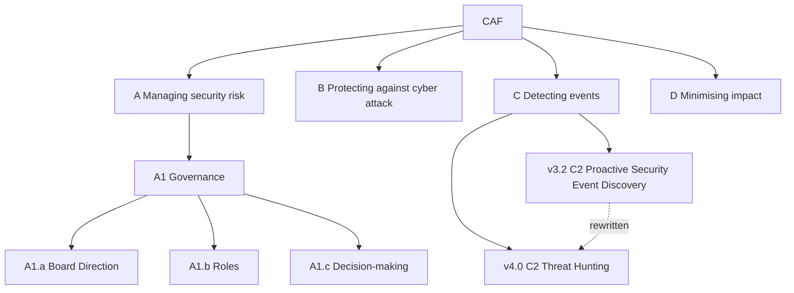

# Machine Simplified Schema — Cyber Assessment Framework

Type-safe, Zod-validated compilation of the NCSC **Cyber Assessment
Framework** (CAF). One repository, two instances:

- **CAF v3.2** — published 15 April 2024
- **CAF v4.0** — published 4 August 2025 (current)

This is a **citation backbone for LLMs and tools**. Import the package,
query by id, fail if the id does not exist. Do not scrape the HTML and
hope the model remembers contributing-outcome numbers.

**Not an official NCSC or UK Government product. Not a CAF assessment.**

## Why this exists

An LLM given NCSC HTML will invent an outcome id. An LLM given this
package can only emit ids that parse. That is the first guardrail: the
model cannot speak a CAF that is not in the type.

## Install

GitHub only — this package is not published to npm.

```bash
npm install github:Darkhouseenterprises/mss_Cyber_Assessment_Framework
```

```ts
import { caf40, caf32, findOutcome, mapForward } from "mss-cyber-assessment-framework";

findOutcome(caf40, "C2.a");
mapForward("C2.a");
```

`npm run validate` parses both instances and the v3.2→v4.0 mapping
through Zod and exits non-zero on any violation. It also writes
instance graphs to `graph/data.js`. Open `graph/index.html` and switch
between CAF v4.0, v3.2, and the mapping.



## What is in the schema

- **Structural tree:** Framework → Objective (A–D) → Principle →
  Contributing outcome → Indicator of Good Practice
- **Two instances:** `caf32` (39 contributing outcomes) and `caf40`
  (41 contributing outcomes)
- **Mapping:** `v32ToV40` — principle, outcome and IGP rows with
  `unchanged` | `rewritten` | `split` | `merged` | `removed` | `new`

Indicator ids follow the NCSC changelog convention:
`A1.a.NA.1` / `A1.a.PA.1` / `A1.a.A.1`.

v3.2 principle C2 remains **Proactive Security Event Discovery**
(C2.a System Abnormalities for Attack Detection, C2.b Proactive Attack
Discovery). v4.0 C2 is **Threat Hunting**.

Source: <https://www.ncsc.gov.uk/collection/cyber-assessment-framework>
retrieved 2026-09-12.

## Licence

CAF text is **Crown copyright**. It stays with the Crown.
The Crown's free-to-use instrument is the
[Open Government Licence v3.0](https://www.nationalarchives.gov.uk/doc/open-government-licence/version/3/).
This compilation does not transfer that copyright and does not grant
official status. It is not a CAF assessment.

Contains public sector information licensed under the Open Government
Licence v3.0.

The schema, identifiers, mapping and tooling are original work,
MIT-licensed. See `LICENSE`, `NOTICE` and `LICENSES/`.

## Series

Part of [Machine Simplified Schema](https://github.com/Darkhouseenterprises):
typed UK public standards for models to cite instead of hallucinate.

- [`mss_Teal_Book`](https://github.com/Darkhouseenterprises/mss_Teal_Book)
- [`mss_Orange_Book`](https://github.com/Darkhouseenterprises/mss_Orange_Book)
- [`mss_Cyber_Assessment_Framework`](https://github.com/Darkhouseenterprises/mss_Cyber_Assessment_Framework)
